# GenAI UAV

[AI CUP 2024 Spring Official Competition Website](https://tbrain.trendmicro.com.tw/Competitions/Details/34)

Generative-AI Navigation Information Competition for UAV Reconnaissance in Natural Environments I：Image Data Generation

以生成式AI建構無人機於自然環境偵察時所需之導航資訊競賽 I － 影像資料生成競賽

🚀 Check [workshop.ipynb](workshop.ipynb) to reproduce the result we've made.

🤗 Or follow the [Usage](#usage) to customize your workflow!

📈 Check [Result](#result) or refer to the [Submission History](#submission-history) section for more details.

## Team ID: TEAM_5333

**Placement:**
- Public: 18th
- Private: 13th

**Members:**
- **Chen-Yang Yu**, NCKU (Team Leader)
- Yuan-Chun Chiang, NTU
- Yu-Hao Chiang, NCKU 
- Xin-Xian Lin, NCKU

**Collaboration:**
- Team 5574: [Sherry2580/AI-cup-2024-spring](Sherry2580/AI-cup-2024-spring)

## Introduction
Our task is to translate the **black-and-white draft imagery** into **drone imagery**.


Domain Type| Draft Imagery             | Drone Imagery             |
|-------| ------------------------- | ------------------------- |
|Road| 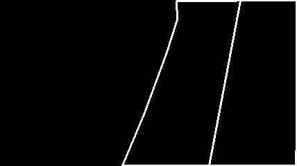 | 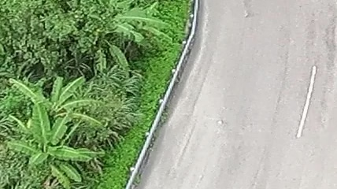 |
|River| 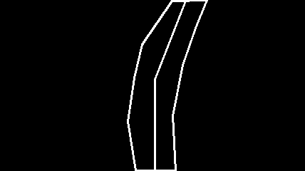 | 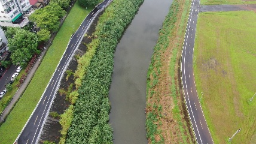 |

## Dataset
### Format
The dataset contains 2 domains: 

- `label_img`: black-and-white draft imagery.
- `img`: drone imagery.

### Preprocess
We have provided some preprocessing method in our code, including:

- Data Filtering (remove low-quality images at `img`):
    
    we remove the image that is too blurry.
    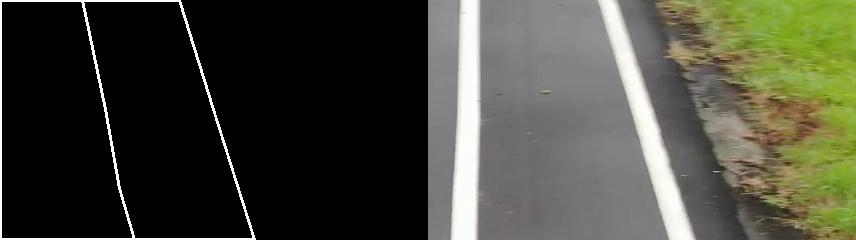

- Data Augmentation:
    
    we employ horizontal flip and vertical flip to augment the dataset.
    | Raw Image | Method |Results|
    | --------- | ---------------------------- |---|
    | 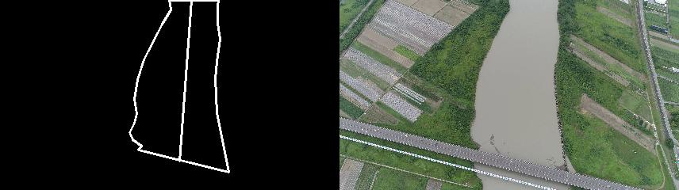 | Horizontal Flip | 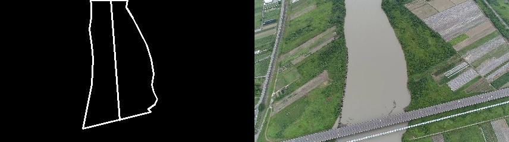 |
    | 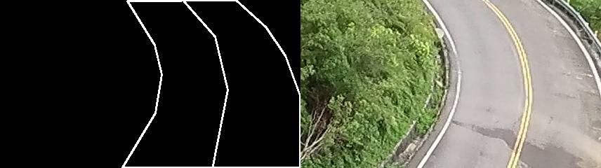 | Vertical Flip | 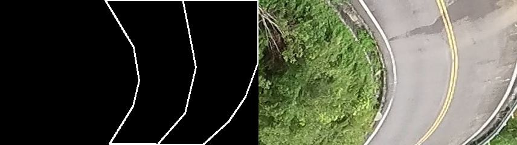 |

- Dataset Split (Enhanced Model's Architecture): 
    
    split the dataset into `RIVER` and `ROAD` domains. 
    ```
    dataset
    ├── train_ROAD
    │   ├── trainA (Draft Images)
    │   └── trainB (Drone Images)
    └── train_RIVER
        ├── trainA (Draft Images)
        └── trainB (Drone Images)
    ```

Note: we do not get the best result by using all the above methods.

## Model Pipeline
We propose 2 methods to train the model.
1. Baseline (ROAD-RIVER at same time)
2. Enhanced (2 domain-specific models)
### Baseline (ROAD-RIVER at same time)
At first, we train the model with all the ROAD and RIVER dataset at the same conditional GAN model. However, the result is not good enough. 
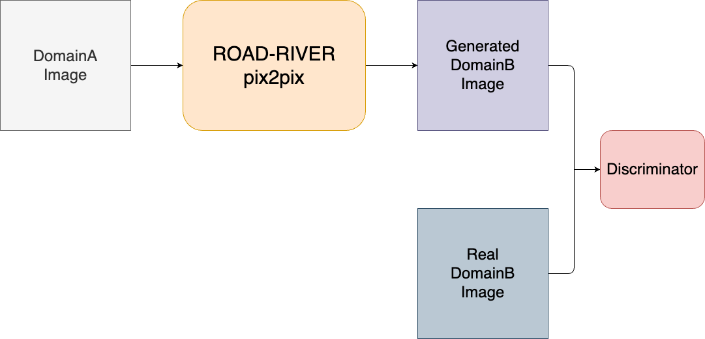

### Enhanced (2 domain-specific models)
Hence, we proposed to train 2 domain-specific models for ROAD and RIVER dataset separately. 
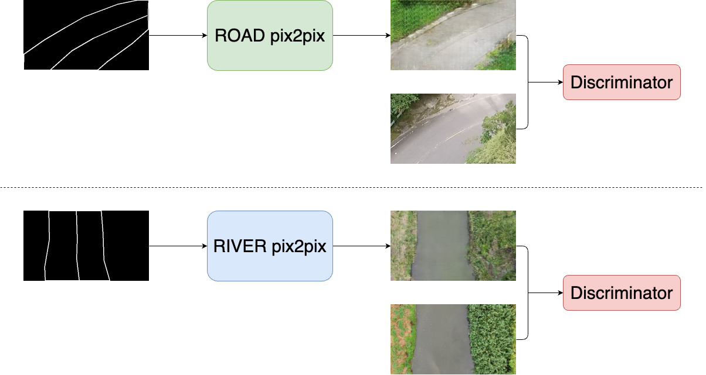

## Other Methods
### Hyperparameter Tuning
We have tried to tune the hyperparameters, including `n_epochs`, `n_epochs_decay`, `batch_size`, `netG`.
The best result we got is to train the model with the following hyperparameters:
```
n_epochs = 200 
n_epochs_decay = 200
batch_size = 1
netG = unet_256
```
### Super Resolution
Since the result from the pix2pix model is in `256x256` format, we tried to use the super resolution method to upscale the image to 428x240. However, the result did not improve a lot.
(You can check the super resolution code in [other/super_resolution.ipynb](other/super_resolution.ipynb))

### Potential Method to Improve
We believe that the result can be improved by using [pix2pixHD](https://github.com/NVIDIA/pix2pixHD) or [img2img-turbo](https://github.com/GaParmar/img2img-turbo). 

However, due to the lack of hardware resources and competition time limitation, we did not try this method.

## Result
We show the result of the baseline and enhanced model in the following table.

> FID (Frechet Inception Distance) as the evaluation metric. <br> The lower the score, the better the result.

| Model                                                 | Public Testing | Private Testing   |
| ----------------------------------------------------- | -------------- | ----------------- |
| Baseline                                              | 141.6813       | x                 |
| **Enhanced**                                          | **129.4026**   | **128.060178996** |
| Enhanced <br>+ data filtering <br>+ data augmentation | 206.5882       | 206.667928949     |

Unfortuantely, when we try to add more data preprocess to our dataset, the result turns worse. Since we train the model with batch_size 64, which cause the GAN learning unstable. If we have more time, we will try to train the model with a smaller batch size.

## Setup
```bash
git clone https://github.com/LittleFish-Coder/gen-ai-uav
```
```bash
cd gen-ai-uav
```
```bash
pip install -r requirements.txt
```

Make sure you download the dataset from the [AI cup website](https://tbrain.trendmicro.com.tw/Competitions/Details/34), and put the dataset in the `gen-ai-uav/dataset` folder.

## Usage
> run [workshop.ipynb](workshop.ipynb) to directly reproduce the result we've made.

Before you start, make sure you have finished the [Setup](#setup) section.

At this section, we have 3 steps for you to follow:

(you can customize your own workflow by following the steps below)
1. Prepare The Dataset
2. Train The Model (optional)
3. Test The Model


> In each notebook, we provide baseline and enhanced method for you to follow. (You can just finish the basline part for quick testing.)
### 1. Prepare The Dataset
Run `dataset/preprocess_dataset.ipynb` to download and preprocess the dataset.

### 2. Train The Model (optional)
We have provided the pre-trained model, you can directly move to the [next step](#test-the-model). 

If you want to train the model, please run `train_model.ipynb`

### 3. Test The Model
We provide the pre-trained model, you can directly run `test_model.ipynb` for baseline dataset testing.

## Submission History
unfold the details to see the submission history.
<details>

| Time | Filename                            | Public Score | Private Score | Description                                                                                          |
| ---- | ----------------------------------- | ------------ | ------------- | ---------------------------------------------------------------------------------------------------- |
| 4/24 | submission.zip                      | Format Error | x             | Inference with AI cup pretrained-weight                                                              |
| 5/04 | submission1.zip                     | 178.4705     | x             | 1. Inference with pre-trained-weight <br>2. Preprocess: invert the white and black color             |
| 5/04 | submission2.zip                     | 182.4264     | x             | test the model with trained-weight-epoch-40                                                          |
| 5/04 | submission3.zip                     | 181.2201     | x             | test the model with trained-weight-epoch-170                                                         |
| 5/05 | submission400.zip                   | 172.6293     | x             | test the model with trained-weight-epoch-400                                                         |
| 5/05 | submission200.zip                   | 142.2167     | x             | retrain the model with 200 epoch since I misuse the training set                                     |
| 5/06 | submission_road_river.zip           | 134.3143     | x             | train 2 domain-specific models for road and river train with 200 epochs                              |
| 5/17 | submission_retrain200.zip           | 142.1900     | x             | 1. use the re-trained weights for all dataset (200 epochs) <br>2. test the image in single_test_mode |
| 5/17 | submission_road_river_80epochs.zip  | 144.3565     | x             | train 2 domain-specific models for 80 epochs and test in single mode                                 |
| 5/17 | submission_all_load_size_256.zip    | 141.6813     | x             | test the image in single_test_mode and load_size as 256                                              |
| 5/18 | submission_road_river_400epochs.zip | 124.7482     | x             | train 2 domain-specific models for 400 epochs and test in single mode                                |
| 5/21 | submission_retrain200_resnet.zip    | 172.1164     | 1000.0        | retrain model with resnet block                                                                      |
| 5/21 | submission_private_resnet.zip       | 1000.0       | 173.808621769 | use the resnet trained model to inference on private testing dataset                                 |
| 5/21 | submission_private_unet256.zip      | 1000.0       | 138.084645591 | use the unet256 trained model to inference on the private testing dataset                            |
| 5/25 | submission_road_river_400.zip       | 129.4026     | 128.060178996 | 1. test with public and private dataset <br> 2. train 2 domain-specific model for 400 epochs         |
| 5/26 | upscaled_images.zip                 | 126.9314     | 128.301406203 | use super resolution to upscale image from 256x256 to 420x240                                        |
| 5/26 | submission_428_240.zip              | 133.3959     | 132.658006179 | upscale 2 domain data in 428x240 (before: I miss resize the size in 420x240)                         |
| 5/26 | upscaled_images_428_240.zip         | 127.3133     | 129.260890304 | super resolution upscale to 428x240                                                                  |
| 5/27 | submission_1000epoch.zip            | 132.2360     | 131.510869954 | retrain model with data filtered with 1000epoch and resize with interpolation CUBIC                  |
| 5/27 | submission_400_interpolation.zip    | 133.2471     | 130.429431557 | use pretrained 400 netG and resize using interpolation cubic                                         |
| 5/28 | submission_400_1000.zip             | 206.5882     | 206.667928949 | train from 400 pre-trained to 1000                                                                   |
| 5/28 | upscaled_images.zip                 | 1000.0       | 156.563343145 | upscale image (only private) _ 400 epoch                                                             |
| 5/28 | submission_20.zip                   | 147.1295     | 147.788939653 | refinetune the dataset and train 20 epoch                                                            |


</details>


## Acknowledgements & Reference
- [junyanz/pytorch-CycleGAN-and-pix2pix](https://github.com/junyanz/pytorch-CycleGAN-and-pix2pix)
```
@inproceedings{CycleGAN2017,
  title={Unpaired Image-to-Image Translation using Cycle-Consistent Adversarial Networks},
  author={Zhu, Jun-Yan and Park, Taesung and Isola, Phillip and Efros, Alexei A},
  booktitle={Computer Vision (ICCV), 2017 IEEE International Conference on},
  year={2017}
}


@inproceedings{isola2017image,
  title={Image-to-Image Translation with Conditional Adversarial Networks},
  author={Isola, Phillip and Zhu, Jun-Yan and Zhou, Tinghui and Efros, Alexei A},
  booktitle={Computer Vision and Pattern Recognition (CVPR), 2017 IEEE Conference on},
  year={2017}
}
```
- Cowork Team 5574: [Sherry2580/AI-cup-2024-spring](https://github.com/Sherry2580/AI-cup-2024-spring)

- https://blog.csdn.net/JNingWei/article/details/78218837
- https://stackoverflow.com/questions/23853632/which-kind-of-interpolation-best-for-resizing-image