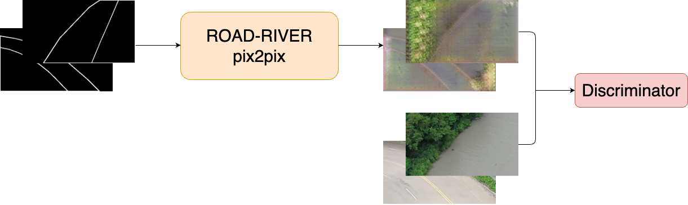

# GenAI UAV

[AI CUP 2024 Spring](https://tbrain.trendmicro.com.tw/Competitions/Details/34)


Generative-AI Navigation Information Competition for UAV Reconnaissance in Natural Environments I：Image Data Generation

(以生成式AI建構無人機於自然環境偵察時所需之導航資訊競賽 I － 影像資料生成競賽)


- Team ID: TEAM_5333
- Place: 18(Public), 13 (Private)
- Member:
    - Chen-Yang Yu, NCKU (Leader)
    - Yuan-Chun Chiang, NTU
    - Yu-Hao Chiang, NCKU 
    - Xin-Xian Lin, NCKU

## Introduction
Our task is to translate the black-and-white draft image into drone imagery.

| draft imagery             | drone imagery             |
| ------------------------- | ------------------------- |
|  |  |

## Pipeline
### Baseline (ROAD-RIVER at same time)
At first, we train the model with the all the ROAD and RIVER dataset at the same conditional GAN model. However, the result is not good enough. The model can not distinguish the ROAD and RIVER draft image well.


### Enhanced (2 domain-specific models)
Hence, we proposed to train 2 domain-specific models for ROAD and RIVER dataset separately. 


## Dataset
The dataset contains 2 domains: 

- `label_img`: black-and-white draft imagery.
- `img`: drone imagery.

We have done some preprocessing on the dataset, including:
- split the dataset into `RIVER` and `ROAD` dataset. (Enhanced Model's Architecture)
- data filtering (remove low-quality images at `img`)
- data augmentation (horizontal flip, vertical flip)


Note: we do not get the best result by using all the above methods, some method may worsen the result.


## Result
We show the result of the baseline and enhanced model in the following table.

FID (Frechet Inception Distance) as the evaluation metric.
The lower the score, the better the result.
| Model                                                 | Public Testing | Private Testing   |
| ----------------------------------------------------- | -------------- | ----------------- |
| Baseline                                              | 141.6813       | x                 |
| **Enhanced**                                          | **129.4026**   | **128.060178996** |
| Enhanced <br>+ data filtering <br>+ data augmentation | 206.5882       | 206.667928949     |

Unfortuantely, when we try to add more data preprocess to our dataset, the result turns worse. Since we train the model with batch_size 64, which cause the GAN learning unstable. If we have more time, we will try to train the model with a smaller batch size.

## Setup
```bash
git clone https://github.com/LittleFish-Coder/gen-ai-uav
```
```bash
cd gen-ai-uav
```

Make sure you download the dataset from the [AI cup website](https://tbrain.trendmicro.com.tw/Competitions/Details/34), and put the dataset in the `gen-ai-uav/dataset` folder.

## Usage
Follow the steps below to prepare the dataset, train the model, and test the model.
1. Prepare The Dataset
2. Train The Model (optional)
3. Test The Model

In each notebook, we provide baseline and enhanced method for you to follow.

You can just finish the basline part for quick testing.
### Prepare The Dataset
Run `preprocess_dataset.ipynb` to download and preprocess the dataset.

### Train The Model (optional)
We have provided the pre-trained model, you can directly move to the [next step](#test-the-model). 

If you want to train the model, please run `train_model.ipynb`

### Test The Model
We provide the pre-trained model, you can directly run `test_model.ipynb` for baseline dataset testing.
## Submission History
unfold the details to see the submission history.
<details>

| Time | Filename                            | Public Score | Private Score | Description                                                                                          |
| ---- | ----------------------------------- | ------------ | ------------- | ---------------------------------------------------------------------------------------------------- |
| 4/24 | submission.zip                      | Format Error | x             | Inference with AI cup pretrained-weight                                                              |
| 5/04 | submission1.zip                     | 178.4705     | x             | 1. Inference with pre-trained-weight <br>2. Preprocess: invert the white and black color             |
| 5/04 | submission2.zip                     | 182.4264     | x             | test the model with trained-weight-epoch-40                                                          |
| 5/04 | submission3.zip                     | 181.2201     | x             | test the model with trained-weight-epoch-170                                                         |
| 5/05 | submission400.zip                   | 172.6293     | x             | test the model with trained-weight-epoch-400                                                         |
| 5/05 | submission200.zip                   | 142.2167     | x             | retrain the model with 200 epoch since I misuse the training set                                     |
| 5/06 | submission_road_river.zip           | 134.3143     | x             | train 2 domain-specific models for road and river train with 200 epochs                              |
| 5/17 | submission_retrain200.zip           | 142.1900     | x             | 1. use the re-trained weights for all dataset (200 epochs) <br>2. test the image in single_test_mode |
| 5/17 | submission_road_river_80epochs.zip  | 144.3565     | x             | train 2 domain-specific models for 80 epochs and test in single mode                                 |
| 5/17 | submission_all_load_size_256.zip    | 141.6813     | x             | test the image in single_test_mode and load_size as 256                                              |
| 5/18 | submission_road_river_400epochs.zip | 124.7482     | x             | train 2 domain-specific models for 400 epochs and test in single mode                                |
| 5/21 | submission_retrain200_resnet.zip    | 172.1164     | 1000.0        | retrain model with resnet block                                                                      |
| 5/21 | submission_private_resnet.zip       | 1000.0       | 173.808621769 | use the resnet trained model to inference on private testing dataset                                 |
| 5/21 | submission_private_unet256.zip      | 1000.0       | 138.084645591 | use the unet256 trained model to inference on the private testing dataset                            |
| 5/25 | submission_road_river_400.zip       | 129.4026     | 128.060178996 | 1. test with public and private dataset <br> 2. train 2 domain-specific model for 400 epochs         |
| 5/26 | upscaled_images.zip                 | 126.9314     | 128.301406203 | use super resolution to upscale image from 256x256 to 420x240                                        |
| 5/26 | submission_428_240.zip              | 133.3959     | 132.658006179 | upscale 2 domain data in 428x240 (before: I miss resize the size in 420x240)                         |
| 5/26 | upscaled_images_428_240.zip         | 127.3133     | 129.260890304 | super resolution upscale to 428x240                                                                  |
| 5/27 | submission_1000epoch.zip            | 132.2360     | 131.510869954 | retrain model with data filtered with 1000epoch and resize with interpolation CUBIC                  |
| 5/27 | submission_400_interpolation.zip    | 133.2471     | 130.429431557 | use pretrained 400 netG and resize using interpolation cubic                                         |
| 5/28 | submission_400_1000.zip             | 206.5882     | 206.667928949 | train from 400 pre-trained to 1000                                                                   |
| 5/28 | upscaled_images.zip                 | 1000.0       | 156.563343145 | upscale image (only private) _ 400 epoch                                                             |
| 5/28 | submission_20.zip                   | 147.1295     | 147.788939653 | refinetune the dataset and train 20 epoch                                                            |


</details>


## Reference
- https://blog.csdn.net/JNingWei/article/details/78218837
- https://stackoverflow.com/questions/23853632/which-kind-of-interpolation-best-for-resizing-image